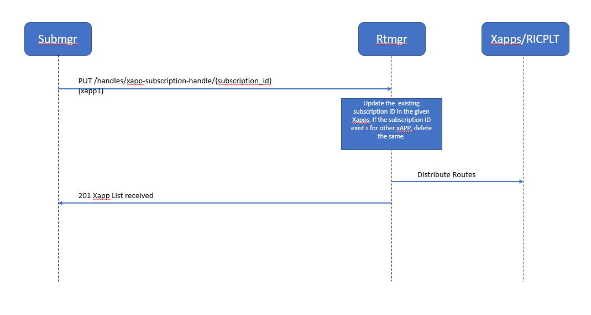

..  Copyright (c) 2019 AT&T Intellectual Property.
..  Copyright (c) 2019 Nokia.
..
..  Licensed under the Creative Commons Attribution 4.0 International
..  Public License (the "License"); you may not use this file except
..  in compliance with the License. You may obtain a copy of the License at
..
..    https://creativecommons.org/licenses/by/4.0/
..
..  Unless required by applicable law or agreed to in writing, documentation
..  distributed under the License is distributed on an "AS IS" BASIS,
..  WITHOUT WARRANTIES OR CONDITIONS OF ANY KIND, either express or implied.
..
..  See the License for the specific language governing permissions and
..  limitations under the License.
..

API-Docs
========

This is the API-docs of ROUTING MANAGER 

.. contents::
   :depth: 3
   :local:

.. note

API Introduction
-----------------
Routing Manager interacts with the following RIC platform components.

.. code::

   * Appmgr:

     1. POST API to request the xapp list available
      http://<rtmgr_http_service_IP>/ric/v1/xapps
     2. POST API to send the xapps that either get deployed or undeployed
      http://<rtmgr_http_service_IP>/ric/v1/handles/xapp-handle
             

.. code::   

   * Submgr:

     1. POST API to provide the subscription details 
      http://<rtmgr_http_service_IP>/ric/v1/handles/xapp-subscription-handle

     2. DELETE API to delete the subscription details
      http://<rtmgr_http_service_IP>/ric/v1/handles/xapp-subscription-handle

     3. PUT API to update the subscriptionID for given xApp.
      http://<rtmgr_http_service_IP>/ric/v1/handles/xapp-subscription-handle/{subscription_id}

.. code::    

   * E2Mgr:

     1. POST API to Add E2Termination Instance
      http://<rtmgr_http_service_IP>/ric/v1/handles/e2t

     2. DELETE API to Delete E2Termination Instance
      http://<rtmgr_http_service_IP>/ric/v1/handles/e2t 

     3. POST API to Associate RAN names to a given E2Termination
      http://<rtmgr_http_service_IP>/ric/v1/handles/associate-ran-to-e2t

     4. DELETE API to Dissociate RAN names to a given E2Termination
      http://<rtmgr_http_service_IP>/ric/v1/handles/dissociate-ran

.. code::    

   * Health Check:

     1. GET API's to retrieve the Aliveness and Readyness checks
      http://<rtmgr_pod_IP>:8080/ric/v1/health/alive
      http://<rtmgr_pod_IP>:8080/ric/v1/health/ready
       

API Functions
-------------
1. Routing Manager request the xapp list and E2Term list available during startup.

2. AppMgr send complete xapps list whenever a xapp is deployed/undeployed

3. Subscription Manager adds/deletes subscription ID 

4. Update the subscription ID for given xApp.(Subscription Merge Add)

5. Update the subscription ID for given xApp.(Subscription Merge Delete)

6. E2Mgr sends request to Add/Delete E2Termination Instance

7. E2Mgr sends request to Associate/Dissociate RAN names to a given E2Termination Instance

